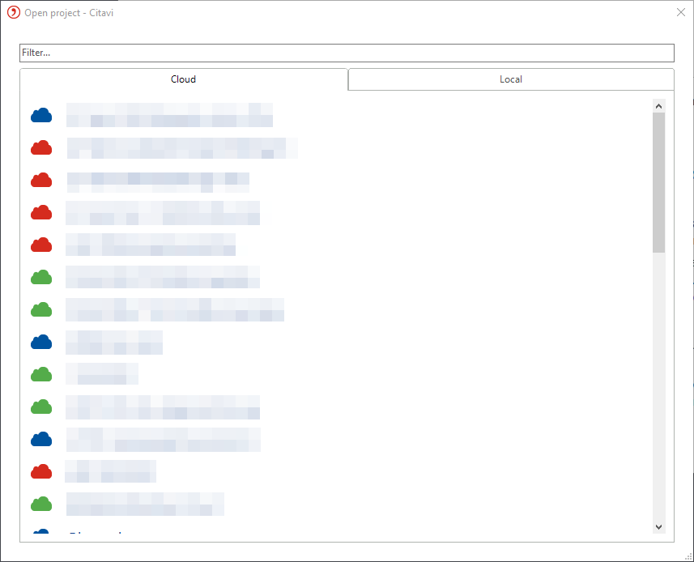

# [Add-Ons for Citavi 6](https://github.com/QSRINT/C6-Add-Ons-and-Online-Sources#add-ons-for-citavi-6) [适用于 Citavi 6 的插件](https://github.com/QSRINT/C6-Add-Ons-and-Online-Sources#add-ons-for-citavi-6)

---

# Adding DOI names from Linked PDF Files 从链接的 PDF 文件中添加 DOI 名称

如果你的项目中许多参考文献的 DOI 字段为空，但你知道附加的 PDF 文件中包含 DOI，你可以使用此插件自动将 DOI 添加到每个参考文献中。

1.  在 **工具** 菜单中，单击 **管理加载项**。
2.  选择 **从链接的 PDF 中提取 DOI** 加载项。然后，单击 **安装** 并重启 Citavi。
3.  在 **参考文献** 菜单中，单击 **从 PDF 添加 DOI**。
4.  此加载项将搜索所有附加的 PDF 文件，并将找到的 DOI 名称填入参考文献选项卡的相应字段中。

---

# Calculating the Page Count 计算页数

如果你想确定一篇期刊文章、文集文章或贡献的页数。

1.  在 **工具** 菜单中，单击 **管理加载项**。
2.  选择 **计算页数** 加载项。然后，单击 **安装** 并重启 Citavi。
3.  对于期刊文章、编著文集或会议录中的贡献，在 **页码范围** 字段中输入参考文献的起始页和结束页。此加载项会计算总页数并将其填入 **页数** 字段。如果在 **参考文献** 选项卡上看不到此字段，请单击 **更多字段**，然后选中“页数”字段旁边的复选框。

> **提示**
> 安装加载项后，它会自动为你添加到项目中的新参考文献计算页数。

---

# Check Links and Change Access Date 检查链接并更改访问日期

你想检查项目中网页链接是否仍然有效？

此加载项会检查项目中所有在线地址字段中的条目，以查看网页是否仍然可用。如果可用，加载项会将当前日期填入 **访问日期** 字段。在 **备注** 字段中，你会看到一条关于加载项对每个参考文献所做更改的简短说明。如果你愿意，可以告诉加载项为那些在线地址不可用的参考文献创建一个选集。

1.  在 **工具** 菜单中，单击 **管理加载项**。
2.  选择 **检查链接并更改访问日期** 加载项。然后，单击 **安装** 并重启 Citavi。
3.  在 **参考文献** 菜单中，单击 **检查链接并更改访问日期**。
4.  等待直到出现一个显示检查结果的窗口。

> **请注意**
> 检查在后台进行，可能需要几分钟。不会显示进度条。在加载项工作期间，你无法继续处理项目。

---

# Converting a Citavi 6 project to Citavi 5 format 将 Citavi 6 项目转换为 Citavi 5 格式

你在 Citavi 6 中创建了一个项目。现在你想与仍在使用 Citavi 5 的人共享此项目。此加载项将 Citavi 6 数据导出为 XML 文件。

1.  在 **工具** 菜单中，单击 **管理加载项**。
2.  选择 **将 Citavi 6 项目转换为 Citavi 5 格式** 加载项。然后，单击 **安装** 并重启 Citavi。
3.  如果你使用的是云项目，请[创建一个本地副本](https://www1.citavi.com/sub/manual6/en/converting_cloud_projects.html)。
4.  打开本地项目。在 **文件** 菜单中，单击 **此项目** > **导出到 Citavi 5**。
5.  为要导出的 XML 文件输入名称，然后单击 **保存**。
6.  复制[用于在 Citavi 5 中导入 Citavi 6 XML 文件的宏](https://www.citavi.com/github-makro-importc6xml)，你可以在 Github 上找到它。
7.  启动 Citavi 5。
8.  打开现有项目或创建新项目。
9.  在 **工具** 菜单中，单击 **宏编辑器**。
10. 输入你在步骤 6 中复制到剪贴板的宏代码。
11. 在宏编辑器中，单击 **运行**。
12. 选择你在 Citavi 6 项目中使用加载项创建的 XML 文件。
13. Citavi 将要求保存一个新项目。为新项目输入名称。
14. 将 Citavi 6 附件文件夹的内容复制到新的 Citavi 5 项目的附件文件夹中。

---

# Correcting Author Names in All Caps 更正全大写的作者姓名

从在线数据库或在线搜索导入参考文献到 Citavi 后，你可能会注意到一些作者姓名显示为全大写。出现此问题的原因是 Citavi 只是按原样导入原始数据库中的条目。你可以通过单击 **列表** > **个人与组织** 来手动更改单个作者姓名。

如果你想更改大量作者姓名，可以使用此加载项一次性更正所有姓名。

1.  在 **工具** 菜单中，单击 **管理加载项**。
2.  选择 **更正全大写的作者姓名** 加载项。然后，单击 **安装** 并重启 Citavi。
3.  创建一个[项目备份](https://www1.citavi.com/sub/manual6/en/using_backups.html)。
4.  在 **列表** 菜单中，单击 **个人与组织**。
5.  在个人菜单中，单击 **更正全大写的作者姓名**。
6.  作者姓名将被更正（例如，从 JACOB, FELICITA 更正为 Jacob, Felicita）。

---

# Display Macros 显示宏

此加载项需要 Citavi 6.8 或更高版本。

你希望在 Citavi 中自动化某些流程。在 [Citavi 支持门户](http://www.citavi.com/list-of-makros)中，你可以找到宏的集合。

此加载项使你更轻松地管理你的宏。

1.  在 **工具** 菜单中，单击 **管理加载项**。
2.  选择 **显示宏** 加载项。然后，单击 **安装** 并重启 Citavi。
3.  单击新的 **宏** 菜单项。
4.  选择 **配置**。
5.  选择计算机上包含宏文件或你希望保存宏文件的文件夹。该文件夹可以包含子文件夹以便更好地组织。
6.  单击 **宏** 并选择你想要运行或编辑的宏。

---

# Exporting Attachments to a Folder Tree 将附件导出到文件夹树

使用此加载项，你可以从项目中导出所有附件。

如果你正在处理云项目，请在运行加载项之前先[下载附件](https://www1.citavi.com/sub/manual6/en/downloading_attachments.html)。

项目中的所有附件将被导出到与 Citavi 中的类别树相对应的文件夹结构中。每个 PDF 将保存在以其附加参考文献所分配的类别命名的文件夹中。

> **提示**
> 如果你愿意，可以先在项目中创建一个选集，然后仅导出当前选集的参考文献。如果你只想导出在文档中引用的参考文献的 PDF 文件，这很有意义。为此，请打开使用 Citavi 创建的 Word 文档。然后，在 Citavi 中，选择筛选器 **[按当前文档中的引文](https://www1.citavi.com/sub/manual6/en/wai_editing_cited_references.html)**。

1.  在 **工具** 菜单中，单击 **管理加载项**。
2.  选择 **将附件导出到文件夹树** 加载项。然后，单击 **安装** 并重启 Citavi。
3.  在 **参考文献** 菜单中，选择 **将附件导出到文件夹树**。

---

# Importing folders as categories 将文件夹作为类别导入

此加载项需要 Citavi 6.5 或更高版本。

你有一个包含子文件夹的文件夹，其中包含 PDF 文件。现在你想在 Citavi 中将文件夹结构作为类别系统导入，并同时导入 PDF 文件。

此加载项将所有 PDF 作为参考文献导入，并创建一个包含这些参考文献的类别系统。

1.  在 **工具** 菜单中，单击 **管理加载项**。
2.  选择 **将文件夹作为类别导入** 加载项。然后，单击 **安装** 并重启 Citavi。
3.  在 **参考文献** 菜单中，单击 **将文件夹作为类别导入**。
4.  选择计算机上包含要导入的 PDF 文件夹的顶级文件夹。
5.  等待直到出现一个显示导入结果的窗口。

> **请注意**
> 导入在后台进行，可能需要几分钟。不会显示进度条。在加载项工作期间，你无法继续处理项目。

---

# Importing Journal Abbreviations 导入期刊缩写

生命科学领域的许多引文样式要求在参考文献中缩写期刊名称。例如，用缩写 *New Eng J Med* 或 *NEJM* 代替 *The New England Journal of Medicine*。在你的项目中，你可以在 **列表** > **期刊** 下双击期刊名称后手动添加缩写。

**导入期刊缩写** 加载项可以一次性为特定缩写列表添加所有缩写。

1.  在 **工具** 菜单中，单击 **管理加载项**。
2.  选择 **导入期刊缩写** 加载项。然后，单击 **安装** 并重启 Citavi。
3.  在 **列表** 菜单中，单击 **期刊**。
4.  单击 **导入期刊缩写**。
5.  选择列表来源：
    1.  从文件（见下文）
    2.  如果你处理的是医学期刊，则从 PubMed 导入
    3.  如果你处理的是自然科学领域的期刊，则从英属哥伦比亚大学导入

## 从文件导入

要导入的期刊列表需要保存为 .txt 文件，并且需要满足以下要求：

-   每行包含一个期刊。
-   每行包含全名、最多 3 个缩写和一个 ISSN。
-   使用制表符、分号、等号或竖线作为分隔符。

以下是一些有效格式的示例：

-   全名; 缩写 1
-   全名; 缩写 1; 缩写 2
-   全名; 缩写 1; 缩写 2; 缩写 3

-   全名; 缩写 1; 缩写 2; 缩写 3; ISSN
-   全名;;;;ISSN

---

# Import sequence numbers 导入序号

此加载项需要 Citavi 6.5 或更高版本。

你希望继续使用以前在旧版 Citavi 中分配给所有参考文献的序号。

为此，请从你的旧项目中导入序号：

1.  在 **工具** 菜单中，单击 **管理加载项**。
2.  选择 **导入序号** 加载项。然后，单击 **安装** 并重启 Citavi。
3.  在 Citavi 6 中打开 Citavi 3、4 或 5 的项目（如果尚未打开），将其转换为*本地* Citavi 6 项目。
4.  在 Citavi 6 中，单击 **文件** 菜单中的 **此项目**。
5.  单击 **导入序号**。选择 Citavi 3、Citavi 4 或 Citavi 5 项目。
6.  选择应将序号导入到的自定义字段。

---

# Ordering Books and Articles by Email 通过电子邮件订购书籍和文章

此加载项需要 Citavi 6.8 或更高版本。

如果你想向当地书店发送书籍订单，或者想从公司负责人那里订购期刊文章，请使用此加载项。

-   对于 Outlook 用户：
    加载项会生成一封包含你选择的文本的电子邮件，并发送给你选择的电子邮件地址。它会自动将参考文献的书目信息插入到电子邮件中。
-   对于使用其他电子邮件程序的用户：
    加载项会将书目信息和你选择的文本复制到剪贴板。

## 设置加载项

1.  在 **工具** 菜单中，单击 **管理加载项**。
2.  选择 **通过电子邮件订购书籍** 加载项。然后，单击 **安装** 并重启 Citavi。
3.  在 **任务与位置** 选项卡上，单击 **订购**。
4.  如果你愿意，可以为未来的订单保存一段简短的文本。单击 **配置订购** 并输入你选择的文本。这是一个示例文本：
    > *尊敬的先生/女士，*
    > *我想订购下面列出的书籍，以便在贵店取货。书籍到货后请通知我。*
    > *此致，*
    > *John Doe*
5.  在 **收件人** 字段中，输入你要向其发送订单的人的电子邮件地址。
6.  单击 **确定** 关闭窗口。

## 发送你的订单

1.  切换到你要订购的参考文献。
2.  在 **任务与位置** 选项卡上，单击 **订购**。
3.  单击 **通过电子邮件订购** 或 **通过剪贴板订购**。

---

# Reference Counts 参考文献计数

此加载项需要 Citavi 6.5 或更高版本。

此加载项创建列表来回答以下问题：

-   项目中每个类别的参考文献数量是多少？
-   项目中的每个人撰写或贡献的参考文献数量是多少？
-   按作者性别划分的参考文献数量是多少？
-   每个关键词在项目中出现的频率是多少？
-   每个参考文献到其他参考文献的链接数量是多少？

按照以下步骤安装加载项。

1.  在 **工具** 菜单中，单击 **管理加载项**。
2.  选择 **参考文献计数** 加载项。然后，单击 **安装** 并重启 Citavi。
3.  在 **参考文献** 菜单中，单击 **参考文献计数**。
4.  选择要查看的列表类型。
5.  将列表复制到剪贴板。如果你想在 MS Excel 或其他电子表格程序中使用该列表，请使用文本导入向导（文件类型“固定宽度”）插入它。

---

# Save Table View Selection 保存表格视图选择

此加载项需要 Citavi 6.4 或更高版本。

此加载项允许你将列和分组的选择保存为工作区。

1.  在 **工具** 菜单中，单击 **管理加载项**。
2.  选择 **保存表格视图选择** 加载项。然后，单击 **安装** 并重启 Citavi。
3.  要打开表格视图，在 **参考文献编辑器** 中，单击 **表格**  或按 Alt+Ctrl+T。
4.  在表格中添加[额外的列](https://www1.citavi.com/sub/manual6/en/sorting_in_table_view.html)或[分组参考文献](https://www1.citavi.com/sub/manual6/en/grouping_references.html)，然后通过 **视图** > **工作区** > **保存新工作区** 保存你的选择。
5.  下次你想在表格视图中使用保存的工作区时，单击 **视图** > **工作区**，然后选择你保存的工作区。

你可以在 **视图** > **工作区** > **管理工作区** 下删除、重命名或排序你保存的工作区。

---

# Send reference by email 通过电子邮件发送参考文献

> **请注意：**
> 此加载项需要 Citavi 6.8 或更高版本。它仅适用于 Microsoft Outlook 2007 及更高版本。

如果你想让其他人了解你 Citavi 项目中的参考文献，并同时发送他们全文或其他附件，请使用此加载项。

1.  在 **工具** 菜单中，单击 **管理加载项**。
2.  选择 **通过电子邮件发送参考文献** 加载项。然后，单击 **安装** 并重启 Citavi。
3.  在参考文献编辑器中，切换到你想通过电子邮件发送的参考文献。
4.  在 **参考文献** 菜单中，单击 **通过电子邮件发送参考文献**。
5.  Citavi 启动 Outlook 并在新电子邮件中输入参考文献的书目信息。任何附加文件也将作为附件添加。为方便收件人导入书目信息，RIS 文件也会作为附件添加到电子邮件中。

---

# Sorting by Parent and Child References 按父级和子级参考文献排序

此加载项需要 Citavi 6.8 或更高版本。

默认情况下，Citavi 按短标题的字母顺序对参考文献编辑器中的所有参考文献进行排序。此加载项为参考文献列表添加了一个额外的排序选项，以将书籍中的贡献显示在书籍下方。

1.  在 **工具** 菜单中，单击 **管理加载项**。
2.  选择 **按父级和子级参考文献排序** 加载项。然后，单击 **安装** 并重启 Citavi。
3.  在导航窗格中，右键单击参考文献列表中的参考文献。
4.  单击 **排序**。
5.  选择 **按短标题（将父级和子级参考文献保持在一起）**。然后，贡献将以其出现的书籍为父级，缩进显示在其下方。

---

# Synchronized Navigation of Categories and Keywords 类别和关键词的同步导航

此加载项确保在参考文献编辑器和知识组织器中选择了相同的类别或关键词。

要使用此加载项，类别和关键词列需要在参考文献编辑器和知识组织器中都显示。单击 **视图** > **显示类别列** (Alt+5) 或 **显示关键词列** (Alt+4)。

1.  在 **工具** 菜单中，单击 **管理加载项**。
2.  选择 **类别和关键词的同步导航** 加载项，单击 **安装** 并重启 Citavi。

---

# Updating Reference Information 更新参考文献信息

此加载项需要 Citavi 6.5 或更高版本。

当你处理一个包含许多引用数据不完整的参考文献的项目时，其中一部分参考文献将拥有 PubMed ID (PMID) 或 DOI。你可能希望使用这些标识符，用来自 PubMed 或 CrossRef 的完整数据覆盖你已有的引用数据。

此加载项在你的项目中搜索具有 PMID 或 DOI 的参考文献，并为它找到的每个标识符运行查询。一旦 PubMed 传递完整的引用数据，Citavi 就会使用它来覆盖现有的引用数据。如果 PubMed 未提供任何数据，或者参考文献只有 DOI，则会向 CrossRef 发送查询。

1.  在 **工具** 菜单中，单击 **管理加载项**。
2.  选择 **使用 PMID 更新参考文献信息** 加载项。然后，单击 **安装** 并重启 Citavi。
3.  在 **参考文献** 菜单中，单击 **更新书目信息**。
4.  选择是否覆盖或保持摘要、目录、关键词和备注不变。
5.  单击 **确定**。

---

# Using the Tomato Timer 使用番茄计时器

此加载项需要 Citavi 6.8 或更高版本。

此加载项旨在帮助你在 Citavi 中集中精力工作。它是 [番茄工作法](https://de.wikipedia.org/wiki/Pomodoro-Technik) 的简化版本。

按照以下步骤安装加载项。

1.  在 **工具** 菜单中，单击 **管理加载项**。
2.  选择 **番茄计时器** 加载项。然后，单击 **安装** 并重启 Citavi。
3.  你将在 Citavi 项目的右下角看到一个番茄图标。
4.  当你点击番茄时，一个 20 分钟的计时器将启动。在这个“工作阶段”期间，你应该忽略所有干扰（智能手机调至飞行模式，将聊天程序设置为“离开”等）。
5.  20 分钟的工作阶段结束后，将开始一个 5 分钟的休息时间。利用这段时间站起来活动一下，喝杯咖啡，查看消息等。
6.  5 分钟后，下一个工作阶段将开始。
7.  经过四个工作和休息阶段后，将会有一个 15 分钟的长休息。这最好用于一些活动。

计时器不是特定于项目的。如果你同时在多个 Citavi 项目中工作，计时器仍然会出现。

你可以再次点击它来重置计时器。

你可以在网上或 Windows 商店中找到类似的程序，但此加载项是专门为你在 Citavi 中的工作而设计的。

---

# ReferencesToolbox 参考文献工具箱

## 具体功能分解

我们可以从它的用户界面入口和后台处理逻辑来理解其具体功能。

### 1. 主要功能入口（在 `ReferencesToolboxUI.cs` 中定义）

这个插件在Citavi的“参考文献”菜单中添加了三个主要命令：

#### **ParallelReportersParse (并引报告解析)**

-   **中文名参考**：`Parallelfundstellen als eigene Parallelfundstellentitel erfassen` (将并引报告记录为独立的并引标题)
-   **快捷键**：`Ctrl + Shift + P`
-   **用途**：这是插件最核心的功能。当你选中一个或多个法律条目后执行此命令，它会：
    1.  **解析引文信息**：从条目的 `CustomField1`、`CustomField2` 和 `TitleSupplement` 字段中提取混杂在一起的多个报告信息（例如：`"SCC 34" and "DLR (3d) 345"`）。
    2.  **标准化日期**：将条目的日期格式（如 "1 January 2023"）统一转换为ISO标准格式（"2023-01-01"）。
    3.  **拆分并引报告**：将解析出的每一个报告都创建为一个**新的、独立的参考文献条目**。
    4.  **填充字段**：为每个新条目正确填充 `Periodical` (期刊)、`Year` (年份)、`Volume` (卷)、`Number` (期)、`PageRange` (页码) 等核心字段。
    5.  **清理原条目**：将原始条目的第一个报告信息保留，并清空用于解析的临时字段。

#### **ShorthandChangeInParallelReporters (在并引报告中更改简称)**

-   **中文名参考**：`Kurzbezeichnung in allen Parallelfundstellentiteln ändern` (在所有并引标题中更改简称)
-   **用途**：当你修改一个案例的引注键（Citation Key，即短标题）时，这个功能可以**自动将所有与之相关的并引报告条目的引注键也同步修改**，确保同一个案例的不同报告版本拥有统一的引注键。

#### **PageRangeAssign (分配页码范围)**

-   **中文名参考**：`Seitenbereich anhand der Startseite und der PDF-Anlage berechnen` (根据起始页和PDF附件计算页码范围)
-   **用途**：这个功能在提供的代码中没有具体实现，但从命名和上下文推断，它应该是用来根据你输入的起始页码和关联的PDF附件，自动计算出总页数并填充到 `PageRange` 字段。

### 2. 附加功能（在右键菜单中）

#### **CopyLocationPathToClipboard (复制文件路径到剪贴板)**

-   **中文名参考**：`Dateipfad in Zwischenablage kopieren`
-   **用途**：在附件列表中右键点击一个电子文件（如PDF），选择此命令，可以直接将该文件的**本地完整路径**复制到剪贴板，非常方便用于引用或分享。

---

# AddCitaviProjectToRecentListAddon (将当前项目添加到最近列表的插件)
此插件将当前项目添加到任务栏应用程序图标的最近使用文件列表中。仅支持**桌面版**项目！
## Releases (发布版本)
编译后的库文件可在 [releases](./../../releases) 中以归档形式找到。
## Disclaimer (免责声明)
>本公司 **Swiss Academic Software GmbH**（**Citavi** 提供商）对此插件不提供任何支持声明，也不对问题或数据损失承担任何责任。任何使用均由您自行承担风险。**Citavi** 的名称及所有使用的徽标均归 **Swiss Academic Software GmbH** 所有。
## License (许可证)
本项目基于 [MIT](LICENSE) 许可证授权。
# JumpToLastPositionAfterActionExecutionAddon (执行操作后跳转到上次位置的插件)
此插件在 Citavi 的 PDF 查看器的**工具**菜单中添加命令**跳转到上一个位置...**，并为其分配快捷键 <kbd>ALT</kbd>+<kbd>F3</kbd>。当通过点击文档中存储的内部链接进行跳转时，该命令会激活。在文档打开期间，它会始终保存执行跳转前的最后位置。
## Releases (发布版本)
编译后的库文件可在 [releases](./../../releases) 中以归档形式找到。
## Disclaimer (免责声明)
>本公司 **Swiss Academic Software GmbH**（**Citavi** 提供商）对此插件不提供任何支持声明，也不对问题或数据损失承担任何责任。任何使用均由您自行承担风险。**Citavi** 的名称及所有使用的徽标均归 **Swiss Academic Software GmbH** 所有。
## License (许可证)
本项目基于 [MIT](LICENSE) 许可证授权。
# KnownProjectsCleanerAddon (已知项目清理插件)
此插件在您启动 Citavi 时检查桌面项目是否仍然可用，并在必要时将其从最近打开的项目列表中删除。
## Releases (发布版本)
编译后的库文件可在 [releases](./../../releases) 中以归档形式找到。
## Disclaimer (免责声明)
>本公司 **Swiss Academic Software GmbH**（**Citavi** 提供商）对此插件不提供任何支持声明，也不对问题或数据损失承担任何责任。任何使用均由您自行承担风险。**Citavi** 的名称及所有使用的徽标均归 **Swiss Academic Software GmbH** 所有。
## License (许可证)
本项目基于 [MIT](LICENSE) 许可证授权。
# OfflineSwitchAddon (离线模式切换插件)
此插件在 Citavi 的主窗体中添加了两个快捷方式。第一个位于**工具** >> **上线** / **下线**，快捷键为 <kbd>CTRL</kbd>+<kbd>Q</kbd>，用于切换在线/离线模式。使用隐藏快捷键 <kbd>CTRL</kbd>+<kbd>ALT</kbd>+<kbd>Q</kbd> 可以运行从启动窗体使用该命令时显示的对话框。
## Releases (发布版本)
编译后的库文件可在 [releases](./../../releases) 中以归档形式找到。
## Disclaimer (免责声明)
>本公司 **Swiss Academic Software GmbH**（**Citavi** 提供商）对此插件不提供任何支持声明，也不对问题或数据损失承担任何责任。任何使用均由您自行承担风险。**Citavi** 的名称及所有使用的徽标均归 **Swiss Academic Software GmbH** 所有。
## License (许可证)
本项目基于 [MIT](LICENSE) 许可证授权。
# OpenFormsCenteredToParentAddon (窗体居中打开插件)
此插件为所有继承自 `FormBase` 的打开窗口设置 `StartPosition` 属性为 `FormStartPosition.CenterParent`（相对于父窗体居中）。
## Releases (发布版本)
编译后的库文件可在 [releases](./../../releases) 中以归档形式找到。
## Disclaimer (免责声明)
>本公司 **Swiss Academic Software GmbH**（**Citavi** 提供商）对此插件不提供任何支持声明，也不对问题或数据损失承担任何责任。任何使用均由您自行承担风险。**Citavi** 的名称及所有使用的徽标均归 **Swiss Academic Software GmbH** 所有。
## License (许可证)
本项目基于 [MIT](LICENSE) 许可证授权。
# OpenWithAddon (打开方式插件)
此插件在本地文件（**题名**选项卡）的上下文菜单中添加命令**打开方式...**，该命令会调用 Windows 资源管理器的标准对话框。这提供了使用非默认程序打开文件的可能性。
## Releases (发布版本)
编译后的库文件可在 [releases](./../../releases) 中以归档形式找到。
## Disclaimer (免责声明)
>本公司 **Swiss Academic Software GmbH**（**Citavi** 提供商）对此插件不提供任何支持声明，也不对问题或数据损失承担任何责任。任何使用均由您自行承担风险。**Citavi** 的名称及所有使用的徽标均归 **Swiss Academic Software GmbH** 所有。
## License (许可证)
本项目基于 [MIT](LICENSE) 许可证授权。
# PDFSplitAddon (PDF拆分插件)
此插件为本地 PDF 文件的上下文菜单添加一个新功能。此功能允许您为父级参考文献的子级题名裁剪 PDF 文件。
## Releases (发布版本)
编译后的库文件可在 [releases](./../../releases) 中以归档形式找到。
## Usage (使用方法)
注意：此插件只能用于本地（!）项目，不能用于云项目。同样重要的是，此插件只能用于父级参考文献中的贡献（Contributions）。此插件从整本书的 PDF 中提取所需页面，并将它们作为附件分配给每个贡献。
请遵循以下步骤：
1. 安装 Citavi 6 的最新更新 [下载](https://www.citavi.com/download)。您也可以[在此处查看](https://www.citavi.com/beta)是否有包含所有最新错误修复的测试版。
2. 关闭 Citavi 6。
3. 在[插件页面](https://github.com/lutz/PDFSplitAddon)上，点击 `Release` 部分的 [releases](https://github.com/lutz/PDFSplitAddon/releases)，并下载那里链接的插件 ZIP 文件。
4. 右键单击 ZIP 文件并单击 `全部解压缩` 来解压插件。
5. 将所有解压的文件复制到目录 `{Citavi 安装目录}\AddOns`（通常是 `C:\Program Files (x86)\Citavi 6\AddOns`）。如果您尚未安装手动插件，则必须先自行创建子文件夹 `Addons`。
6. 再次启动 Citavi 6 并打开您的本地项目。
7. 添加编辑过的书籍（包括 PDF 文件）以及您需要的所有贡献，请参阅[手册](https://www1.citavi.com/sub/manual6/en/index.html?101_adding_a_contribution_in_an_edited_book.html)。
8. 在编辑过的书籍的**参考文献**选项卡中，右键单击 PDF 文件，然后单击 `拆分 PDF`。
9. 选择需要根据相应页面创建 PDF 的贡献。请务必输入物理页码，例如，如果书籍包含一些罗马数字的页码部分，或者由于其他原因逻辑页码（每页上打印的页码）不同。
10. 点击 `OK`。
## Disclaimer (免责声明)
>本公司 **Swiss Academic Software GmbH**（**Citavi** 提供商）对此插件不提供任何支持声明，也不对问题或数据损失承担任何责任。任何使用均由您自行承担风险。**Citavi** 的名称及所有使用的徽标均归 **Swiss Academic Software GmbH** 所有。
## License (许可证)
本项目基于 [MIT](LICENSE) 许可证授权。
# PDFThumbnailAddon (PDF缩略图插件)
此插件在 Citavi 的 PDF 查看器的搜索栏中插入页面预览。
## Releases (发布版本)
编译后的库文件可在 [releases](./../../releases) 中以归档形式找到。
## Disclaimer (免责声明)
>本公司 **Swiss Academic Software GmbH**（**Citavi** 提供商）对此插件不提供任何支持声明，也不对问题或数据损失承担任何责任。任何使用均由您自行承担风险。**Citavi** 的名称及所有使用的徽标均归 **Swiss Academic Software GmbH** 所有。
## License (许可证)
本项目基于 [MIT](LICENSE) 许可证授权。
# RemoveLocalProjectAddon (移除本地项目插件)
此插件在启动窗体的每个**本地**项目条目的 **...** 对话框中添加一个 <kbd>移除项目..</kbd> 命令。该命令会删除**附件文件夹**和 `*.ctv` 文件的**父文件夹**。
## Releases (发布版本)
编译后的库文件可在 [releases](./../../releases) 中以归档形式找到。
## Disclaimer (免责声明)
>本公司 **Swiss Academic Software GmbH**（**Citavi** 提供商）对此插件不提供任何支持声明，也不对问题或数据损失承担任何责任。任何使用均由您自行承担风险。**Citavi** 的名称及所有使用的徽标均归 **Swiss Academic Software GmbH** 所有。
## License (许可证)
本项目基于 [MIT](LICENSE) 许可证授权。
# SetPDFSelectionAsAddon (将PDF选区设为插件)
此插件在 Citavi 的 PDF 查看器的**更多**菜单中添加新命令，以将文本选区用作题名数据。
## Releases (发布版本)
编译后的库文件可在 [releases](./../../releases) 中以归档形式找到。
## Disclaimer (免责声明)
>本公司 **Swiss Academic Software GmbH**（**Citavi** 提供商）对此插件不提供任何支持声明，也不对问题或数据损失承担任何责任。任何使用均由您自行承担风险。**Citavi** 的名称及所有使用的徽标均归 **Swiss Academic Software GmbH** 所有。
## License (许可证)
本项目基于 [MIT](LICENSE) 许可证授权。
# SynchronizeFiltersWithFullscreenPreviewAddon (筛选器与全屏预览同步插件)
此插件将筛选后的题名列表与同一项目的所有打开的全屏预览同步。这使您也可以在全屏预览中对选定的题名使用**导出 PDF 注释...**功能。
## Releases (发布版本)
编译后的库文件可在 [releases](./../../releases) 中以归档形式找到。
## Disclaimer (免责声明)
>本公司 **Swiss Academic Software GmbH**（**Citavi** 提供商）对此插件不提供任何支持声明，也不对问题或数据损失承担任何责任。任何使用均由您自行承担风险。**Citavi** 的名称及所有使用的徽标均归 **Swiss Academic Software GmbH** 所有。
## License (许可证)
本项目基于 [MIT](LICENSE) 许可证授权。
# AutoRefAddon (自动引用插件)
此插件为 Citavi 的宏编辑器添加了一个新功能，用于包含自定义引用程序集的指令。每次用户保存宏代码时，插件会向代码文件添加注释。当用户重新打开宏时，注释将被移除，程序集将被添加到内部的宏编辑器编译器服务中。
## Format of comment (注释格式)
```csharp
// autoref "[ASSEMBLYPATH]"
```
## Releases (发布版本)
编译后的库文件可在 [releases](./../../releases) 中以归档形式找到。
## Disclaimer (免责声明)
>本公司 **Swiss Academic Software GmbH**（**Citavi** 提供商）对此插件不提供任何支持声明，也不对问题或数据损失承担任何责任。任何使用均由您自行承担风险。**Citavi** 的名称及所有使用的徽标均归 **Swiss Academic Software GmbH** 所有。
## License (许可证)
本项目基于 [MIT](LICENSE) 许可证授权。
# CitaviAddOnEx (Citavi插件扩展库)
此代码库包含一个类库，它扩展了 Swiss Academic Citavi 的插件编程模型，以支持所有继承自 `FormBase` 类的对话框。
## Getting Started (入门指南)
### Prerequisites (先决条件)
使用此库为 Citavi 编程插件的最简单方法是，从 [nuget.org](https://www.nuget.org/packages/CitaviAddOnEx/1.0.3) 包含最新版本并将其随附。Citavi 应安装在默认目录（`C:\Program Files (x86)\Citavi 6`）中。可以使用 Microsoft Visual Studio 2019 Community Edition 作为开发环境。
Citavi 6 使用的目标框架是 .net Framework 4.6.1。
### Programming (编程)
```csharp
using SwissAcademic.Citavi.Shell;
using SwissAcademic.Controls;
using System;
using System.Windows.Forms;
namespace [NAMESPACE]
{
    public class [CLASSNAME] : CitaviAddOnEx<T>
    {
        // 通过 System.Windows.Forms.Application.Idle 事件调用，可用于检查例如按钮状态是否更改
        public override void OnApplicationIdle(T form)
        {
        }
       
        // 在每个 T 类型的窗体加载时调用
        public override void OnHostingFormLoaded(T form)
        {
           
        }
        
        // 在每个 T 类型的窗体关闭时调用
        public virtual void OnHostingFormClosed(T form) 
        { 
           
        }
        // 当用户在窗体中点击某项时调用
        public override void OnBeforePerformingCommand(T form, BeforePerformingCommandEventArgs e)
        {
           
        }
        // 当应用程序语言更改时调用
        public override void OnLocalizing(T form)
        {
            
        }
    }
}
```

要开发插件，您需要从 `CitaviAddOnEx<T>` 类派生，并根据需要实现相应的方法。`T` 必须是一个从 Citavi 模型提供的基类 `FormBase` 派生的窗体。
**示例**
- MainForm
- KnowledgeItemFileForm
- MacroEditor
如果指定了提供固有插件支持的窗体，该类将使用它。
## Wiki (维基)
一些额外信息可以在 [wiki](../..//wiki) 中找到。
## Projects (项目)
[FormatCodeAddon](https://github.com/lutz/FormatCodeAddon) 使用此库来扩展宏编辑器，您可以查看它以获取帮助。
## Disclaimer (免责声明)
>本公司 **Swiss Academic Software GmbH**（**Citavi** 提供商）对此插件不提供任何支持声明，也不对问题或数据损失承担任何责任。任何使用均由您自行承担风险。**Citavi** 的名称及所有使用的徽标均归 **Swiss Academic Software GmbH** 所有。
## License (许可证)
本项目基于 [MIT](LICENSE) 许可证授权。

# CopyTextOfSelectedAnnotationAddon (复制所选注释文本的插件)
此插件为 Citavi 的 PDF 查看器添加一个新功能，用于复制所选 Citavi 高亮标记的文本。选择**一个** Citavi 高亮标记，并使用快捷键组合 <kbd>SHIFT</kbd>+<kbd>C</kbd> 将文本复制到剪贴板。
支持以下 Citavi 高亮标记：
- *直接引语*
- *间接引语*
- *摘要*
- *评论*
- *任务*
- *摘要*
- *目录*
- *高亮*
- *红色高亮*
## Releases (发布版本)
编译后的库文件可在 [releases](./../../releases) 中以归档形式找到。
## Disclaimer (免责声明)
>本公司 **Swiss Academic Software GmbH**（**Citavi** 提供商）对此插件不提供任何支持声明，也不对问题或数据损失承担任何责任。任何使用均由您自行承担风险。**Citavi** 的名称及所有使用的徽标均归 **Swiss Academic Software GmbH** 所有。
## License (许可证)
本项目基于 [MIT](LICENSE) 许可证授权。

# DocFetcherSelectionAddon (DocFetcher选择插件)
此插件在**编辑**菜单中添加一个命令，用于将通过剪贴板转换的 DocFetcher 查找到的文件转换为 Citavi 中的题名选择。
## Releases (发布版本)
编译后的库文件可在 [releases](./../../releases) 中以归档形式找到。
## Disclaimer (免责声明)
>本公司 **Swiss Academic Software GmbH**（**Citavi** 提供商）对此插件不提供任何支持声明，也不对问题或数据损失承担任何责任。任何使用均由您自行承担风险。**Citavi** 的名称及所有使用的徽标均归 **Swiss Academic Software GmbH** 所有。
## License (许可证)
本项目基于 [MIT](LICENSE) 许可证授权。

# FilterOpenProjectsAddon (筛选打开项目插件)
此插件为 Citavi 的打开项目对话框添加了按名称筛选项目列表的功能。

## Releases (发布版本)
编译后的库文件可在 [releases](./../../releases) 中以归档形式找到。
## Disclaimer (免责声明)
>本公司 **Swiss Academic Software GmbH**（**Citavi** 提供商）对此插件不提供任何支持声明，也不对问题或数据损失承担任何责任。任何使用均由您自行承担风险。**Citavi** 的名称及所有使用的徽标均归 **Swiss Academic Software GmbH** 所有。
## License (许可证)
本项目基于 [MIT](LICENSE) 许可证授权。

# GoToPdfPageAddon (跳转到PDF页面插件)
此插件添加一个新命令**跳转到PDF页面**，快捷键为 <kbd>CTRL</kbd>+<kbd>J</kbd>，用于跳转到预览中当前打开的 PDF 文档的物理页码或（如果可用）逻辑页码。
## Releases (发布版本)
编译后的库文件可在 [releases](./../../releases) 中以归档形式找到。
## Disclaimer (免责声明)
>本公司 **Swiss Academic Software GmbH**（**Citavi** 提供商）对此插件不提供任何支持声明，也不对问题或数据损失承担任何责任。任何使用均由您自行承担风险。**Citavi** 的名称及所有使用的徽标均归 **Swiss Academic Software GmbH** 所有。
## License (许可证)
本项目基于 [MIT](LICENSE) 许可证授权。

# HideKnowledgeItemFileFormHelpBoxAddon (隐藏知识项目文件窗体帮助框插件)
此插件隐藏图片引语编辑或文件引语编辑对话框中的帮助框。当在小屏幕上使用 Citavi 时，这尤其有用。
## Releases (发布版本)
编译后的库文件可在 [releases](./../../releases) 中以归档形式找到。
## Disclaimer (免责声明)
>本公司 **Swiss Academic Software GmbH**（**Citavi** 提供商）对此插件不提供任何支持声明，也不对问题或数据损失承担任何责任。任何使用均由您自行承担风险。**Citavi** 的名称及所有使用的徽标均归 **Swiss Academic Software GmbH** 所有。
## License (许可证)
本项目基于 [MIT](LICENSE) 许可证授权。

# HideKnowledgeItemTextFormHelpBoxAddon (隐藏知识项目文本窗体帮助框插件)
此插件隐藏引语编辑对话框中的帮助框。当在小屏幕上使用 Citavi 时，这尤其有用。
## Releases (发布版本)
编译后的库文件可在 [releases](./../../releases) 中以归档形式找到。
## Disclaimer (免责声明)
>本公司 **Swiss Academic Software GmbH**（**Citavi** 提供商）对此插件不提供任何支持声明，也不对问题或数据损失承担任何责任。任何使用均由您自行承担风险。**Citavi** 的名称及所有使用的徽标均归 **Swiss Academic Software GmbH** 所有。
## License (许可证)
本项目基于 [MIT](LICENSE) 许可证授权。


# PDFSplitAddon (PDF拆分插件)
此插件为本地 PDF 文件的上下文菜单添加一个新功能。使用此功能，您可以为父级作品的 PDF 文件裁剪出子级题名的各个部分。
## Veröffentlichungen (发布版本)
编译后的库文件可在 [releases](./../../releases) 中以归档形式找到。
## Anwendung (使用方法)
注意：此插件只能用于本地（!）项目，不能用于云项目。同样重要的是，此插件只能用于包含子级题名的父级作品。此插件从整本书的 PDF 中提取所需页面，并将它们作为附件分配给每个贡献。请事先在每个贡献的 `Seiten von-bis`（页码从-到）字段中记录贡献的页码范围。
请按以下步骤操作：
1. 如果尚未完成或您正在使用较旧的 Citavi 6 版本，请将 Citavi 更新到当前版本。如果未自动提供更新，您可以从 https://www.citavi.com/download 下载当前安装程序并直接安装（无需事先卸载）。所有用 Citavi 收集的数据保持不变。您也可以[在此处](https://www.citavi.com/beta)查看是否有包含所有最新错误修复的 Beta 版本。
2. 关闭 Citavi。
3. 在[插件页面](https://github.com/lutz/PDFSplitAddon)的 `Release` 部分中，点击 [releases](https://github.com/lutz/PDFSplitAddon/releases) 链接，并下载那里链接的插件 ZIP 文件。
4. 右键单击下载的 ZIP 文件，然后选择 `全部解压缩` 来解压文件。
5. 将所有解压的文件复制到目录 `{Citavi 安装目录}\AddOns`（通常是 `C:\Program Files (x86)\Citavi 6\AddOns`）。如果您尚未安装手动插件，则必须先自行创建 `AddOns` 子文件夹。之后，它应该如下所示：
6. 重新启动 Citavi 并打开您的本地（!）项目。
7. 如果尚未完成，请收录文集（Sammelwerk）及其 PDF 文件以及您需要的所有贡献，请参阅[手册](https://www1.citavi.com/sub/manual6/de/index.html?101_adding_a_contribution_in_an_edited_book.html)。
8. 在父级文集的 `Titel`（题名）选项卡中，右键单击最下方的 PDF 文档，然后在上下文菜单中点击 `PDF teilen`（拆分 PDF）条目。
9. 选择需要根据所选页面创建 PDF 的贡献。请注意，如果书籍例如包含一些罗马数字的页码部分，或者逻辑页码（每页上打印的页码）因其他原因不同，请务必输入物理页码。
10. 点击 `OK`。
## Disclaimer (免责声明)
> 对 **Swiss Academic Software GmbH**（**Citavi** 提供商）公司或对问题或数据损失的其他责任索赔均不提供支持声明。任何使用均由您自行承担风险。**Citavi** 的名称及所有使用的徽标的所有权均归 **Swiss Academic Software GmbH** 公司所有。
## License (许可证)
本项目基于 [MIT](LICENSE) 许可证授权。

# AddCitaviProjectToRecentListAddon (将当前项目添加到最近列表的插件 - 重复条目)
此插件将当前项目添加到任务栏应用程序图标的最近使用文件列表中。仅支持**桌面版**项目！
## Releases (发布版本)
编译后的库文件可在 [releases](./../../releases) 中以归档形式找到。
## Disclaimer (免责声明)
>本公司 **Swiss Academic Software GmbH**（**Citavi** 提供商）对此插件不提供任何支持声明，也不对问题或数据损失承担任何责任。任何使用均由您自行承担风险。**Citavi** 的名称及所有使用的徽标均归 **Swiss Academic Software GmbH** 所有。
## License (许可证)
本项目基于 [MIT](LICENSE) 许可证授权。
# ReferencesToolbox (参考文献工具箱)
具体功能分解
我们可以从它的用户界面入口和后台处理逻辑来理解其具体功能。
## 1. 主要功能入口（在 ReferencesToolboxUI.cs 中定义）
这个插件在Citavi的“参考文献”菜单中添加了三个主要命令：
## ParallelReportersParse (并引报告解析)
中文名参考：Parallelfundstellen als eigene Parallelfundstellentitel erfassen (将并引报告记录为独立的并引标题)
快捷键：Ctrl + Shift + P
用途：这是插件最核心的功能。当你选中一个或多个法律条目后执行此命令，它会：
解析引文信息：从条目的 CustomField1、CustomField2 和 TitleSupplement 字段中提取混杂在一起的多个报告信息（例如："SCC 34" and "DLR (3d) 345"）。
标准化日期：将条目的日期格式（如 “1 January 2023”）统一转换为ISO标准格式（“2023-01-01”）。
拆分并引报告：将解析出的每一个报告都创建为一个新的、独立的参考文献条目。
填充字段：为每个新条目正确填充 Periodical (期刊)、Year (年份)、Volume (卷)、Number (期)、PageRange (页码) 等核心字段。
清理原条目：将原始条目的第一个报告信息保留，并清空用于解析的临时字段。
## ShorthandChangeInParallelReporters (在并引报告中更改简称)
中文名参考：Kurzbezeichnung in allen Parallelfundstellentiteln ändern (在所有并引标题中更改简称)
用途：当你修改一个案例的引注键（Citation Key，即短标题）时，这个功能可以自动将所有与之相关的并引报告条目的引注键也同步修改，确保同一个案例的不同报告版本拥有统一的引注键。
## PageRangeAssign (分配页码范围)
中文名参考：Seitenbereich anhand der Startseite und der PDF-Anlage berechnen (根据起始页和PDF附件计算页码范围)
用途：这个功能在提供的代码中没有具体实现，但从命名和上下文推断，它应该是用来根据你输入的起始页码和关联的PDF附件，自动计算出总页数并填充到 PageRange 字段。
## 2. 附加功能（在右键菜单中）
CopyLocationPathToClipboard (复制文件路径到剪贴板)
中文名参考：Dateipfad in Zwischenablage kopieren
用途：在附件列表中右键点击一个电子文件（如PDF），选择此命令，可以直接将该文件的本地完整路径复制到剪贴板，非常方便用于引用或分享。
